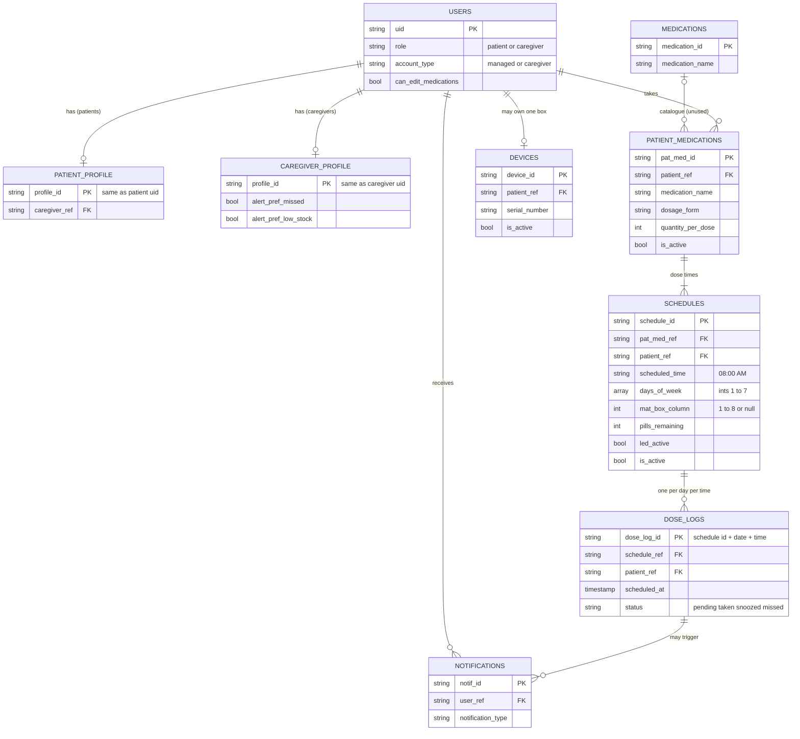
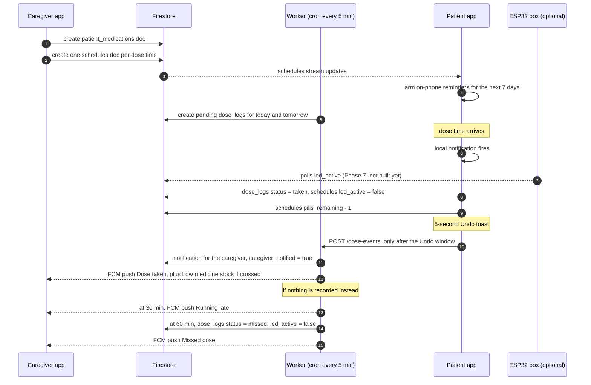
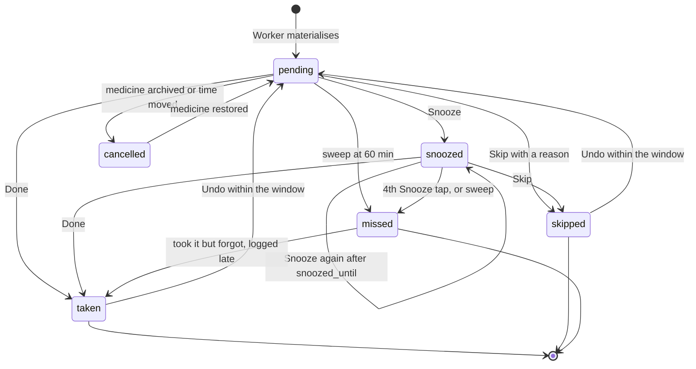

# HealthSync — Medication Data Map

How a medicine is stored, scheduled, reminded, confirmed and synced across the
Flutter app, Firestore, the Cloudflare Worker and the ESP32 box.

Every field below is taken from the code as of October 2026: the Dart models in
`lib/models/`, the writes in `lib/services/`, and the Worker handlers in
`healthsync-api/src/handlers/`. Where CLAUDE.md or an earlier design says
something different, the code wins and the difference is listed in
[section 11](#11-where-claudemd-disagrees-with-the-code).

**Contents**

1. [The map](#1-the-map)
2. [Life of one medicine](#2-life-of-one-medicine)
3. [`patient_medications` — the medicine](#3-patient_medications--the-medicine)
4. [`schedules` — one dose time](#4-schedules--one-dose-time)
5. [`dose_logs` — one dose on one day](#5-dose_logs--one-dose-on-one-day)
6. [`notifications` — alerts about medicines](#6-notifications--alerts-about-medicines)
7. [`devices` — the optional smart box](#7-devices--the-optional-smart-box)
8. [`medications` — the shared catalogue](#8-medications--the-shared-catalogue)
9. [Who writes what (sync paths)](#9-who-writes-what-sync-paths)
10. [Queries, indexes and security rules](#10-queries-indexes-and-security-rules)
11. [Where CLAUDE.md disagrees with the code](#11-where-claudemd-disagrees-with-the-code)
12. [Before launch](#12-before-launch)

---

## 1. The map



Three things the diagram cannot show:

- **A medicine and its dose times are separate documents.** "Metformin twice a
  day" is one `patient_medications` doc and two `schedules` docs (08:00 AM and
  08:00 PM). They are linked by `schedules.pat_med_ref`.
- **A schedule is intent; a dose log is an event.** The Worker turns each
  schedule into one `dose_logs` doc per day it runs, about a day ahead.
  Confirming, snoozing and missing all happen on the dose log.
- **Every medication document carries `patient_ref`.** The security rules
  authorise on it, so every query filters on it too. A query on
  `pat_med_ref` or `schedule_ref` alone is rejected by the rules.

---

## 2. Life of one medicine



### Step by step

| # | What happens | Written by | Documents touched |
|---|---|---|---|
| 1 | Caregiver adds a medicine (3-step wizard) | Caregiver app, `ScheduleProvider.saveNewMedication` | 1 `patient_medications` + N `schedules` |
| 2 | Patient's phone sees the schedules and arms reminders for 7 days | Patient app, `DoseReminderScheduler.syncReminders` | none (local only) |
| 3 | Pending dose logs are created for today and tomorrow (Manila time) | Worker cron, `runMaterialize` | `dose_logs` (status `pending`) |
| 4a | Patient taps **Done** (dashboard, alarm screen or detail screen) | Patient app, `DoseActions.take` → `PatientProvider.takeDose` | `dose_logs` → `taken` with `timing`, `taken_at`, `logged_at`; `schedules.led_active` → false; `schedules.pills_remaining` − 1 |
| 4b | Patient taps **Snooze 10m** (alarm screen only) | Patient app, `PatientProvider.snoozeDose` | `dose_logs` → `snoozed`, `snooze_count` + 1, `snoozed_until` = now + 10 min |
| 4c | Patient taps **Skip** and gives a reason | Patient app, `DoseActions.skip` → `PatientProvider.skipDose` | `dose_logs` → `skipped`, `skipped_reason`, `logged_at` |
| 4d | Patient taps **Undo** within 5 seconds | Patient app, `PatientProvider.undoDoseAction` | the same fields back as they were; pill, LED and low-stock notice restored; Worker never called |
| 5 | Caregiver is told, once the Undo window has closed | Worker, `POST /dose-events` | `notifications` (caregiver), `dose_logs.caregiver_notified` |
| 6 | Stock reaches the threshold or zero | Patient app + Worker | `notifications` for both patient and caregiver |
| 7a | 30 min past and nothing recorded | Worker cron, `runSweep` (late pass) | caregiver `notifications` (`late`); `dose_logs.late_notified` |
| 7b | 60 min past and still pending, or snoozed and abandoned | Worker cron, `runSweep` (missed pass) | `dose_logs` → `missed`; `schedules.led_active` → false |
| 8 | Patient gives a reason for a missed dose | Patient app, `PatientProvider.saveMissedReason` | `dose_logs.skipped_reason`, `acknowledged_at` |
| 8b | …or "I took it but forgot to log it" (until the end of the next day) | Patient app, `PatientProvider.logTakenLate` | `dose_logs` → `taken`, `timing: logged_late`, reported `taken_at`; pill − 1; caregiver gets a `correction` |
| 9 | Caregiver ends the course or archives a mistake | Caregiver app, `deletePatientMedication` | `patient_medications.is_active` → false; its `schedules` → inactive; future pending `dose_logs` → `cancelled` (`archived`); for a mistake, all its logs → `excluded_from_adherence` |
| 10 | Caregiver restores it | Caregiver app, `restoreMedication` | reverses step 9: cancelled future logs → `pending`, exclusion cleared |

Nothing deletes a dose log. The security rules forbid it, and "Delete for
good" was removed from the archive screen.

### Dose log status



- The timeline: **Upcoming** until the dose time (Done/Skip unlock 30 minutes
  before), **Due now** from 0 to 29 minutes, **Late** from 30 to 59 (the
  caregiver gets "Running late"), **Missed** from 60. One implementation:
  `lib/utils/dose_timing.dart`.
- Before the unlock, Done/Skip ask "Logging early?" — allowed up to 3 hours
  before, but never more than half the gap to the previous dose of the same
  medicine.
- A dose can be snoozed 3 times. A 4th tap on Snooze marks it missed.
- A new snooze is refused until `snoozed_until` has passed, so three quick taps
  can no longer burn every snooze at once.
- The sweep marks a **snoozed** dose missed only when it is 60 minutes past
  `scheduled_at` **and** 10 minutes past `snoozed_until`.
- Undo is allowed by the security rules for 2 minutes after `logged_at`; the
  app offers it for 5 seconds.
- A `cancelled` dose is kept but never shown or counted.

---

## 3. `patient_medications` — the medicine

One document per medicine per patient. Document id: Firestore auto-id, copied
into `pat_med_id`.

| Field | Type | Required | Written by | Notes |
|---|---|---|---|---|
| `pat_med_id` | string | yes | app | Same as the document id |
| `patient_ref` | string | yes | app | Patient's uid. Rules authorise on it |
| `medication_ref` | string | yes | app | Always `""` today — see [section 8](#8-medications--the-shared-catalogue) |
| `medication_name` | string | yes | app | Shown everywhere; trimmed |
| `prescribed_dosage` | string | no | app | Free text, e.g. `"500mg"` |
| `quantity_per_dose` | number | yes | app | Units per dose; default `1` |
| `dosage_form` | string | yes | app | `Tablet` · `Capsule` · `Liquid` · `Drops` · `Inhaler` · `Injection`. Missing on older docs → read as `Tablet` |
| `instructions` | string | no | app | e.g. `"Take after meals"` |
| `prescribing_doctor` | string | no | app | |
| `purpose` | string | no | app | |
| `color_label` | string | no | app | Hex, default `"#1B5FD4"` |
| `date_prescribed` | timestamp | yes | app | Set to the save time |
| `start_date` | timestamp | yes | app | |
| `end_date` | timestamp \| null | no | app | Null = no end |
| `is_active` | bool | yes | app | `false` = archived |
| `archived_reason` | string \| null | no | app | `"completed"` or `"mistake"` when archived; `""`/null when active |
| `archived_at` | timestamp \| null | no | app (archive/restore only) | Not in the Dart model; written by `FirestoreService` |
| `updated_at` | timestamp | no | app (archive/restore only) | Not in the Dart model |

Only `Tablet` and `Capsule` default into a box compartment
(`PatientMedicationModel.fitsInBox`).

```json
{
  "pat_med_id": "pm_7Qx2LwV9",
  "patient_ref": "uid_patient_001",
  "medication_ref": "",
  "medication_name": "Metformin",
  "prescribed_dosage": "500mg",
  "quantity_per_dose": 1,
  "dosage_form": "Tablet",
  "instructions": "Take after meals",
  "prescribing_doctor": "Dr. Reyes",
  "purpose": "Blood sugar",
  "color_label": "#1B5FD4",
  "date_prescribed": "2026-10-08T09:15:00+08:00",
  "start_date": "2026-10-08T00:00:00+08:00",
  "end_date": null,
  "is_active": true,
  "archived_reason": ""
}
```

---

## 4. `schedules` — one dose time

One document per dose time. "Metformin at 8 AM and 8 PM" is two schedules.
Document id: Firestore auto-id, copied into `schedule_id`.

| Field | Type | Required | Written by | Notes |
|---|---|---|---|---|
| `schedule_id` | string | yes | app | Same as the document id |
| `pat_med_ref` | string | yes | app | → `patient_medications` |
| `patient_ref` | string | yes | app | Rules authorise on it |
| `scheduled_time` | string | yes | app | `"hh:mm AM"`/`"hh:mm PM"`, zero-padded, e.g. `"08:00 PM"`. The app and Worker also accept `"20:00"` and `"8:00 pm"`. Anything else is skipped, never guessed |
| `days_of_week` | array of int | yes | app | **Integers**, `1` = Monday … `7` = Sunday. Empty = every day |
| `mat_box_column` | int \| null | no | app (caregiver) | `1`–`8`, or **null = not in the box**. Anything outside 1–8 is read as null. Every dose time of one medicine shares one compartment |
| `caregiver_doctor` | string | no | app | Copy of the prescribing doctor |
| `start_date` | timestamp | yes | app | |
| `end_date` | timestamp \| null | no | app | |
| `pills_remaining` | int | yes | app | Stock count. Default `30`. **Per schedule** — see [section 12](#12-before-launch) |
| `low_stock_threshold` | int | yes | app | Default `5` |
| `led_active` | bool | yes | app | The ESP32 polls this |
| `is_active` | bool | yes | app | `false` when the medicine is archived |
| `created_at` | timestamp | yes | app | The materialiser uses it so a medicine added at 11 AM does not create that morning's 8 AM dose |

```json
{
  "schedule_id": "sc_K3pT8mQa",
  "pat_med_ref": "pm_7Qx2LwV9",
  "patient_ref": "uid_patient_001",
  "scheduled_time": "08:00 AM",
  "days_of_week": [1, 2, 3, 4, 5, 6, 7],
  "mat_box_column": 3,
  "caregiver_doctor": "Dr. Reyes",
  "start_date": "2026-10-08T00:00:00+08:00",
  "end_date": null,
  "pills_remaining": 30,
  "low_stock_threshold": 5,
  "led_active": false,
  "is_active": true,
  "created_at": "2026-10-08T09:15:02+08:00"
}
```

Phone-only (no box, or a liquid) is the same document with
`"mat_box_column": null`.

### When a compartment is shown

A screen or notification may name a compartment only when **both** are true:

```
hasBox             = an active devices doc exists for the patient
showsCompartment   = hasBox AND schedule.mat_box_column != null
```

`PatientProvider.showsCompartment()` is the single place this is decided. An
unpaired box keeps its compartment numbers, so re-pairing restores them.

---

## 5. `dose_logs` — one dose on one day

### Document id

```
{schedule_id}_{YYYY-MM-DD}_{HH:mm}
sc_K3pT8mQa_2026-10-09_08:00
```

- The date is the **Manila** calendar date (UTC+8; the Worker runs in UTC and
  shifts by 8 hours).
- `HH:mm` is 24-hour, so `08:00 PM` becomes `20:00`.
- The id is what makes the materialiser safe to re-run every 5 minutes: it
  skips any id that already exists, so a `taken` dose is never reset.
- A dose acted on before its log was materialised is written by the app under
  the **same deterministic id** (`DoseLogModel.idFor`), so the materialiser
  sees it and never creates a second, pending copy. (Older app versions used
  an auto-id, so code that looks up "today's log for a schedule" still goes by
  `schedule_ref` + `scheduled_date` + time, not by id alone.)
- **Never deleted.** The rules say `allow delete: if false`. Doses that will
  no longer happen are set to `cancelled` instead.

| Field | Type | Written by | Notes |
|---|---|---|---|
| `dose_log_id` | string | Worker / app | Same as the document id |
| `schedule_ref` | string | Worker / app | → `schedules` |
| `patient_ref` | string | Worker / app | Rules authorise on it |
| `scheduled_date` | string | Worker / app | `"YYYY-MM-DD"`, Manila date |
| `scheduled_time` | string | Worker / app | Display form, e.g. `"08:00 AM"` |
| `scheduled_at` | timestamp | Worker / app | **Required.** Date + time as one instant. The sweep's range query and all history sorting depend on it |
| `status` | string | all | `pending` · `snoozed` · `taken` · `skipped` · `missed` · `cancelled`. The last four are final; `cancelled` is never shown or counted |
| `timing` | string \| null | app | When taken: `early` (through the early prompt), `on_time` (−30 to +29 min), `late` (+30 to +59), `logged_late` (corrected from missed). Old logs without it are derived from `taken_at` |
| `taken_at` | timestamp \| null | app | Set when taken. For `logged_late`, the time the patient says they took it |
| `logged_at` | timestamp \| null | app | When the patient last acted. The rules allow Undo for 2 minutes after it |
| `snooze_count` | int | app | 0–3 |
| `snoozed_until` | timestamp \| null | app | When the current snooze ends |
| `confirmed_via` | string | app | `"app"` when confirmed in the app; `""` on a fresh pending log. `"button"` is reserved for the box (Phase 7) |
| `caregiver_notified` | bool | Worker | `true` once the caregiver has the alert (pushed, or recorded in their Alerts tab). The app always writes `false` |
| `late_notified` | bool | Worker | The 30-minute running-late alert has been sent (once per dose) |
| `dose_count` | int | Worker / app | Default `1` |
| `acknowledged_at` | timestamp \| null | app | The patient gave a reason for a skipped or missed dose |
| `skipped_reason` | string | app | The reason for a skipped or missed dose, e.g. `"Felt sick / side effects"`, `"Exceeded the 3-snooze limit"` |
| `cancelled_reason` | string \| null | app / Worker | `"archived"` (medicine archived) or `"rescheduled"` (dose time moved) |
| `excluded_from_adherence` | bool | app (caregiver) | `true` on every dose of a medicine archived as "entered by mistake" — kept, never counted |
| `recorded_by` | string | Worker / app | `"system"` for materialised logs; the patient's uid for app-created ones |
| `created_at` | timestamp | Worker / app | |
| `is_active` | bool | Worker / app | Always `true` today; queries filter on it |

The sweep also writes `led_active: false` onto the dose log when marking it
missed. That field is not part of the model and nothing reads it there.

```json
{
  "dose_log_id": "sc_K3pT8mQa_2026-10-09_08:00",
  "schedule_ref": "sc_K3pT8mQa",
  "patient_ref": "uid_patient_001",
  "scheduled_date": "2026-10-09",
  "scheduled_time": "08:00 AM",
  "scheduled_at": "2026-10-09T08:00:00+08:00",
  "status": "taken",
  "timing": "on_time",
  "taken_at": "2026-10-09T08:04:31+08:00",
  "logged_at": "2026-10-09T08:04:31+08:00",
  "snooze_count": 1,
  "snoozed_until": "2026-10-09T08:12:10+08:00",
  "confirmed_via": "app",
  "caregiver_notified": true,
  "late_notified": false,
  "dose_count": 1,
  "acknowledged_at": null,
  "skipped_reason": "",
  "cancelled_reason": null,
  "excluded_from_adherence": false,
  "recorded_by": "system",
  "created_at": "2026-10-08T09:20:00+08:00",
  "is_active": true
}
```

---

## 6. `notifications` — alerts about medicines

| Field | Type | Notes |
|---|---|---|
| `notif_id` | string | Same as the document id |
| `user_ref` | string | Who sees it |
| `dose_log_ref` | string \| null | Set by some writers only |
| `notification_type` | string | See the table below |
| `title`, `message` | string | Display text |
| `sent_at` | timestamp | Lists sort on this, newest first |
| `read_at` | timestamp \| null | Null = unread |
| `channel` | string | `"fcm"` if a push was sent, otherwise `"in_app"` |
| `created_at` | timestamp | The Worker omits it; the app reads a missing value as "now" |
| `is_active` | bool | Queries filter on it |

Medication-related types actually written today:

| `notification_type` | Who receives it | Written by | When |
|---|---|---|---|
| `confirmed` | caregiver | Worker `/dose-events` | Patient took a dose ("took it early/late" when it was) — sent after the Undo window |
| `late` | caregiver | Worker sweep | 30 min past, nothing recorded. Once per dose |
| `missed` | caregiver | Worker sweep, or `/dose-events` | 60 min past, the 3-snooze limit, or a reason given before the sweep ran |
| `skipped` | caregiver | Worker `/dose-events` (sweep as backstop) | Patient skipped, with the reason |
| `correction` | caregiver | Worker `/dose-events` | "I took it but forgot to log it" on a missed dose |
| `low_stock` | patient | Patient app (`NotificationService.sendLowStockAlert`) | A dose brought stock to the threshold, or to 0 |
| `low_stock` | caregiver | Worker `/dose-events` | Same moment. Skipped if `alert_pref_low_stock` is `false` |
| `missed_alert` | caregiver | `NotificationService.sendMissedDoseCaregiverAlert` | Defined but has no callers; screens still render it |

`late`, `missed`, `skipped` and `correction` all follow the caregiver's
"Missed dose alerts" switch (`alert_pref_missed`). Every caregiver alert is
recorded in their Alerts tab even when the push cannot be sent.

Low stock fires only on the two crossings (stock **equals** the threshold, or
**equals** 0), so it does not repeat with every remaining pill.

---

## 7. `devices` — the optional smart box

At most one active device per patient. Its existence is what switches a
patient from phone-only to box mode — there is no separate setting.

| Field | Type | Notes |
|---|---|---|
| `device_id` | string | Same as the document id (auto-id) |
| `device_type` | string | `"esp32_smart_box"` (model default) |
| `device_name` | string | Default `"HealthSync Smart Box"` |
| `serial_number` | string | Uppercase letters, digits and dashes, at least 6 characters |
| `patient_ref` | string | Rules authorise on it |
| `status` | string | `"online"` · `"offline"` |
| `last_sync` | timestamp | Updated by the box heartbeat |
| `columns_active` | int | |
| `firmware_version` | string | Default `"v1.0.0"` |
| `created_at` | timestamp | |
| `is_active` | bool | Only active devices count |

There is **no** `battery_level` field. This build has no battery monitoring.

Pairing is allowed for the patient (from their Box tab) or their caregiver
(from Smart box). **Assigning compartments is caregiver-only**: the rules let a
patient change only `led_active` and `pills_remaining` on a schedule.

---

## 8. `medications` — the shared catalogue

| Field | Type |
|---|---|
| `medication_id` | string |
| `medication_name` | string |
| `generic_name` | string |
| `dosage_form` | string |
| `common_dosages` | array of string |
| `category` | string |
| `created_at` | timestamp |
| `is_active` | bool |

Read-only from every client (`allow write: if false`), so it can only be seeded
from the Firebase console or the Worker. **Nothing seeds it and nothing links to
it**: the add-medicine wizard saves `medication_ref: ""` and copies the name
into `patient_medications.medication_name`. The app works without it. It is
only needed if you want a searchable drug list in step 1.

---

## 9. Who writes what (sync paths)

| Collection | Caregiver app | Patient app | Worker | ESP32 |
|---|---|---|---|---|
| `patient_medications` | create, edit, archive, restore | read | — | — |
| `schedules` | create, edit, assign compartments, archive | read; write **only** `led_active` and `pills_remaining` | read (materialiser); `led_active: false` (sweep) | read `led_active` (Phase 7) |
| `dose_logs` | read; cancel / revive on archive and restore; mark not counted | take, skip, snooze, undo, give a reason, log late; create under the deterministic id if not materialised | create `pending`; revive cancelled; cancel orphaned future `pending`; `late_notified`; mark `missed`; `caregiver_notified` | Phase 7: `confirmed_via: "button"` |
| `notifications` | read own; mark read | write own `low_stock`; read own; mark read | write caregiver alerts | — |
| `devices` | pair for own patient; read | pair; read | — | heartbeat (Phase 7) |
| `medications` | read | read | (could seed) | — |

### Sync rules that keep everything consistent

1. **The phone decides a dose is due; the box only displays it.** The ESP32
   never decides timing.
2. **Firestore first, Worker second.** The app writes the dose log at once,
   then calls `POST /dose-events` when the 5-second Undo window closes. A
   failed or undone call never loses or invents a confirmation; the sweep is
   the backstop.
3. **Re-arm reminders from the stream.** Whenever `schedules`, the medicine
   list, or "box paired yes/no" changes, the patient app cancels and re-creates
   its 7-day local reminders with the current wording.
4. **History is never deleted.** Future `pending` logs are cancelled when a
   medicine is archived or a dose time is edited, and revived on restore.
   Past logs stay as they are; a medicine archived as "entered by mistake"
   has its logs marked not counted.
5. **A compartment moves per medicine, not per dose time.** The Smart box
   screen updates every schedule of the medicine in one batch.
6. **Times are Manila wall-clock.** `scheduled_time` is stored as typed; the
   Worker converts with a fixed UTC+8 offset.

---

## 10. Queries, indexes and security rules

### Queries the app and Worker run

| Query | Where | Index |
|---|---|---|
| `patient_medications` where `patient_ref ==` and `is_active ==` | medicine lists, archive | automatic (equality only) |
| `schedules` where `patient_ref ==` and `is_active ==` | patient + caregiver streams, box screen | automatic |
| `schedules` where `patient_ref ==` and `pat_med_ref ==` | archive / restore / delete | automatic |
| `schedules` where `is_active ==` | Worker materialiser | automatic |
| `dose_logs` where `patient_ref ==`, `is_active ==`, `scheduled_at >=`, order by `scheduled_at` desc | 90-day history stream | `patient_ref` + `is_active` + `scheduled_at` desc ✅ |
| `dose_logs` where `patient_ref ==`, `is_active ==`, `scheduled_date ==` | one day's doses | `patient_ref` + `is_active` + `scheduled_date` ✅ |
| `dose_logs` where `status ==` and `scheduled_at` in a range | Worker sweep: late pass, missed pass, skip backstop | `status` + `scheduled_at` ✅ |
| `dose_logs` where `scheduled_at >=` | Worker materialiser | automatic (single field) |
| `dose_logs` where `patient_ref ==` and `status ==` | cancel future pending (archive), revive cancelled (restore) | automatic |
| `notifications` where `user_ref ==` and `is_active ==` | alert lists | `user_ref` + `is_active` ✅ |
| `devices` where `patient_ref ==` and `is_active ==` | box status | automatic |

Every composite index needed is already in `firestore.indexes.json`. Deploy it
together with the rules:

```
firebase deploy --only firestore:rules,firestore:indexes
```

### Security rules for these collections (`firestore.rules`)

| Collection | Read | Create | Update | Delete |
|---|---|---|---|---|
| `patient_medications` | patient or their caregiver | caregiver of that patient | caregiver of that patient | caregiver of that patient |
| `schedules` | patient or their caregiver | caregiver | caregiver; **or** the patient changing only `led_active` / `pills_remaining` | caregiver |
| `dose_logs` | patient or their caregiver | patient or their caregiver | same, but `patient_ref`, `schedule_ref` and `scheduled_at` cannot change, and the patient is limited to the allowed status changes* | **nobody** (`allow delete: if false`) |
| `notifications` | owner | the user it is addressed to | owner | owner |
| `devices` | patient or their caregiver | patient or their caregiver | same | same |
| `medications` | any signed-in user | nobody | nobody | nobody |

"Caregiver" means the patient's `patient_profile.caregiver_ref` is the
caller. For writes to `patient_medications` and `schedules` the caller must
also have `can_edit_medications == true` on their `users` doc. The Worker uses
admin credentials and bypasses all of these.

\* A patient may move a dose from `pending`/`snoozed` to `taken`, `skipped`,
`snoozed` or `missed`; from `missed` to `taken` only with `timing:
logged_late`; and back from `taken`/`skipped` to `pending`/`snoozed` only
within 2 minutes of `logged_at` (Undo). Same-status edits (a reason, the
snooze count) are allowed; a `cancelled` dose cannot be touched. These rules
are covered by 18 emulator checks.

---

## 11. Where CLAUDE.md disagrees with the code

| CLAUDE.md says | The code actually does | Which to trust |
|---|---|---|
| `schedules.days_of_week` is `["Mon","Tue",…]` | Integers `1`–`7` (1 = Monday). The Worker accepts both | Code. Write integers |
| `schedules.mat_box_column` is `1–8` (older text) | `1`–`8` **or null** | Code (CLAUDE.md is now updated) |
| `medications.common_dosages` is a string | Array of strings | Code |
| `medications.dosage_form` is `tablet`/`capsule`/`liquid` | Capitalised, six values | Code |
| `devices.device_type` is `"medicine_box"` | `"esp32_smart_box"` | Code |
| `patient_medications.created_by` and `updated_at` | `created_by` is never written; `updated_at` only on archive/restore | Code |
| `patient_medications` fields | Also has `medication_name`, `dosage_form`, `purpose`, `color_label`, `archived_reason`, `archived_at` | Code |
| `dose_logs` fields | Also has `dose_count`. (`snoozed_until`, `timing`, `logged_at`, `late_notified`, `cancelled_reason` and `excluded_from_adherence` are now in CLAUDE.md) | Code |
| `confirmed_via` is `"app"` or `"button"` | `"app"`, or `""` on a fresh pending log. `"button"` is not written yet | Code |
| Worker has `GET /device/{serial}/schedule` and `POST /device/{serial}/dose` | Neither endpoint exists yet | Code (Phase 7 work) |

---

## 12. Before launch

These are gaps in the medication data flow, ordered by how much they would hurt
in front of a panel or a real patient.

1. ~~**Dose-log deletes have no security rule.**~~ **Fixed:** nothing deletes a
   dose log any more, and the rules now say `allow delete: if false`.

2. **Stock is counted per dose time, not per medicine.** `pills_remaining`
   lives on each schedule, so "30 tablets, twice a day" becomes two
   independent counters of 30. Each confirmation subtracts from its own dose
   time only. Low-stock alerts therefore fire late (or twice, once per
   counter). Fix: move `pills_remaining` and `low_stock_threshold` to
   `patient_medications`, decrement there by `quantity_per_dose`, and allow
   the patient to update just that field in the rules.

3. **Nothing turns an LED on.** The ESP32 is meant to poll `led_active`, but no
   code in the app or the Worker ever sets it to `true`. Box mode needs the
   materialiser (or the app at dose time) to set `led_active: true` on
   schedules with a compartment, and only when the patient has a box.

4. **The ESP32 endpoints do not exist.** `GET /device/{serial}/schedule` and
   `POST /device/{serial}/dose` are listed in CLAUDE.md but not implemented.
   They should skip any schedule whose `mat_box_column` is null.

5. **The `medications` catalogue is empty and unlinked.** Harmless today.
   Either seed it and pick from it in step 1, or remove it from the paper's data
   dictionary so the panel does not ask where it is used.

6. **Times assume Manila.** The Worker uses a fixed UTC+8 offset. That is
   correct for this deployment; a per-patient timezone would be needed
   anywhere else.

### Launch checklist for medication sync

- [ ] Deploy rules and indexes:
      `firebase deploy --only firestore:rules,firestore:indexes`
- [ ] Deploy the Worker: `npx wrangler deploy` from `healthsync-api/`
- [ ] Confirm the cron is running: Cloudflare dashboard → Workers →
      healthsync-api → Logs should show `Materialise:` lines every 5 minutes
      once any schedule exists
- [ ] Add a medicine with two dose times and check: 1 `patient_medications`
      doc, 2 `schedules` docs, and pending `dose_logs` within 5 minutes
- [ ] Confirm one dose: log becomes `taken`, `pills_remaining` drops by 1,
      caregiver gets "Dose taken" about 5 seconds later (after Undo)
- [ ] Ignore one dose: at 30 minutes the caregiver gets "Running late"; at 60
      the log becomes `missed` and they get "Missed dose"
- [ ] Snooze once and walk away: about 70–75 minutes after the dose time it
      becomes `missed`
- [ ] Set stock to the threshold + 1 and confirm: both patient and caregiver
      get a low-stock alert
- [ ] Archive the medicine: its future pending logs become `cancelled`, past
      logs stay; restore it and they are `pending` again
- [ ] Test once with no box paired and once with a box, using a tablet and a
      liquid each time
